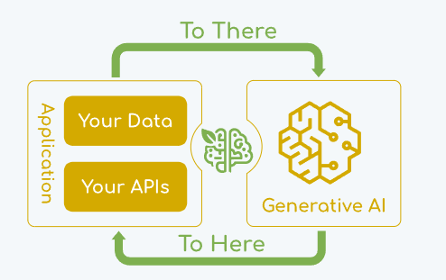
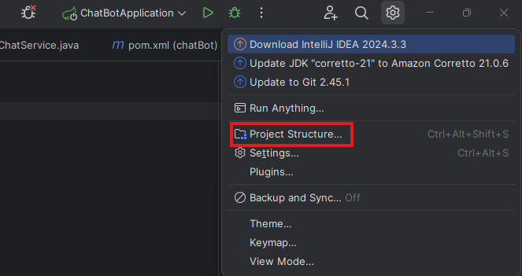
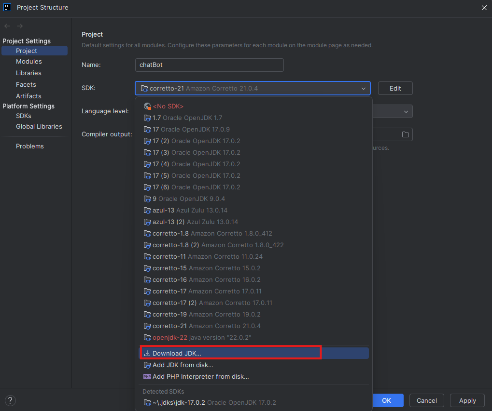
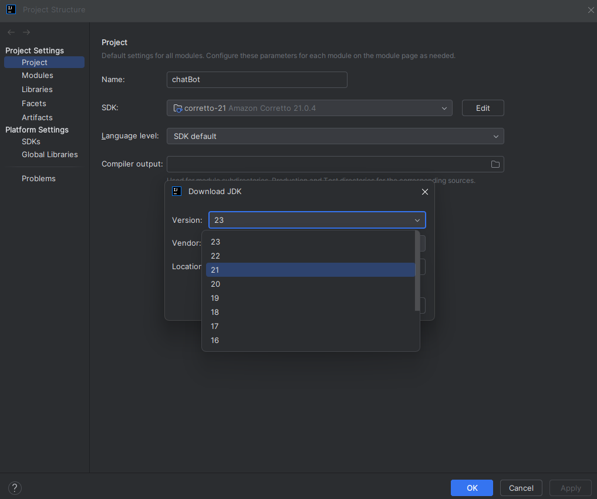
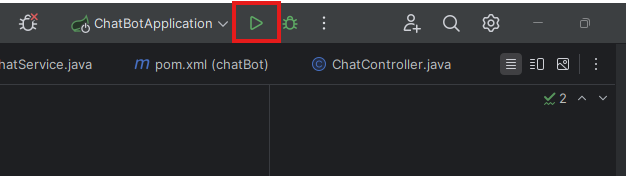

# ChatBot Projects

## Team
Ổn Ổn Thì Sút (D23TXCN07-K)

## Team Member
Nguyễn Văn An (K23DTCN323)
Tống Đức Chung (K23DTCN334)
Nguyễn Huy Hải (K23DTCN348)
Mai Đức Hùng (K23DTCN359)
Trần Văn Phú (K23DTCN387)
Hoàng Anh Sơn (K23DTCN396)
Ngô Viết Anh (K23DTCN489)

## Logical business
The OnOnThiSut team's project is a java project that integrates gpt chat to customize a chatbot capable of talking to
registered users to perform tasks such as: 
- Answering questions
- Generating photos according to user requests.

## Included technologies

- Java 21
- Spring Boot 3.4
- Spring Security
- Spring AI
- PostGreSQL

## Tool
- IntelliJ
- DBeaver

# Overall Design
- todo

# Getting Started

## Step1: Set up enviroment

### Open IntelliJ -> Open Project ChatBot -> Chose Project Structure

### Project Structure -> SDK -> Download JDK

### Chose JDK 21

## Step 2:  Run your Application

## Step 3:  If successful, the application starts on **localhost:8080**, Open your Browser
- http://localhost:8080/ai?message=yourMessage (Replace yourMessage with the question you want to ask the chatbot)
- http://localhost:8080/ai/image?message=yourMessage (Replace yourMessage with the condition you want to set for the chatbot to generate images)